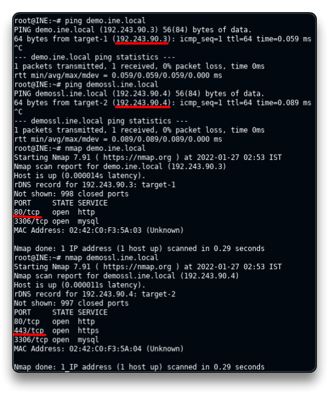

# 🔬HTTP(S) Traffic Sniffing

1. Connect to the Lab VPN (INE in this case) by using OpenVpn and the **.ovpn** file provided. (in my case INE provided a direct Lab Link / Kali GUI instance opened in another tab).
   *   From terminal, check if the machines are reachable:

       `ping demo.ine.local`

       `ping demossl.ine.local`
   *   Check open ports with nmap tool:

       `nmap demo.ine.local`

       `nmap demossl.ine.local`
   *   Check the Kali Machine interface name:

       `ifconfig`



2. Open Wireshark and start the capture on the Vpn network interface.
   * or use the terminal: 
   
```bash
wireshark -i eth1
```

3. Generate traffic from the browser by browsing to the **HTTP** web page (`http://demo.ine.local`) and try a login.

4. The sniffer records the traffic between the browser and the server. Right click on a packet and `Follow TCP Stream` to see the traffic exchange.
   *   In case of HTTP protocol, the clear-text traffic can be sniffed easily. The content of the packets is in human readable form.


5. Restart the capture to clean the results. Try the same login into the **HTTPS** web page (`https://demossl.ine.local`) and check the TCP Stream in the captured traffic.
   * Check the certificate with the lock icon.
   * In case of HTTPS protocol, the traffic is encrypted, unreadable and protected.
   *   HTTPS (HTTP over TLS) protects the content


6. Captured traffic can be filtered in Wireshark with _display filters_.

> 📍 Lab solved!
