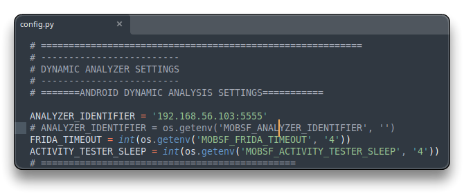
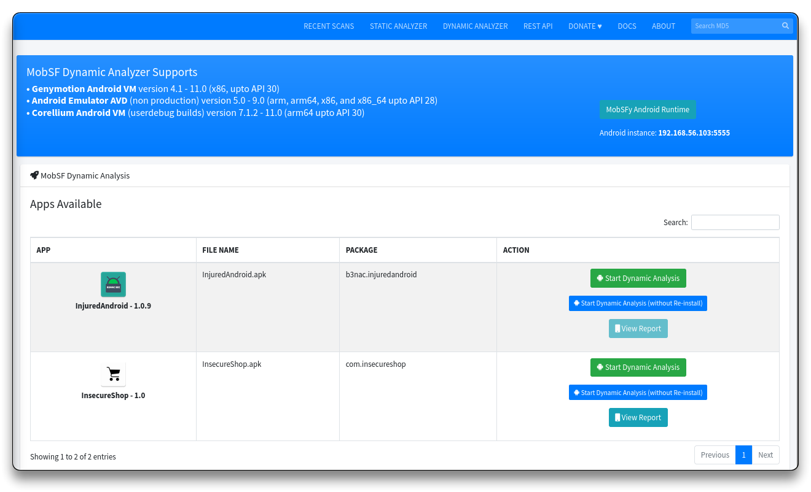
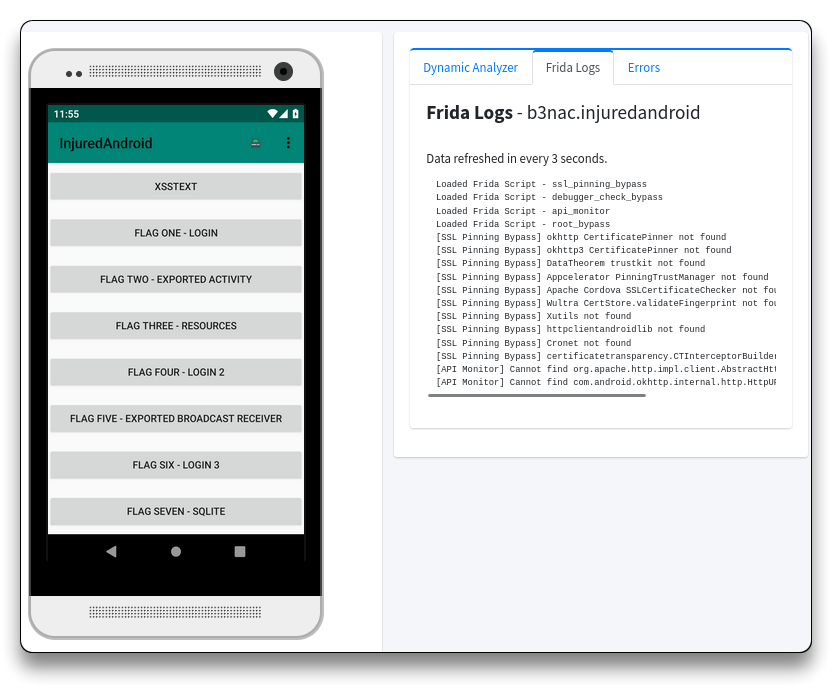
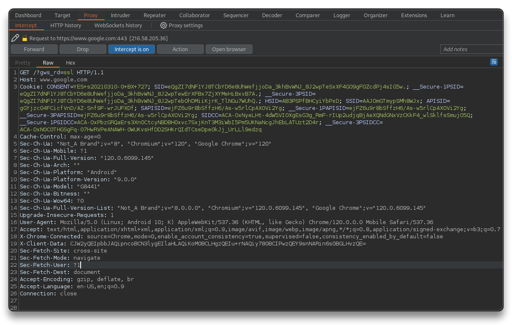
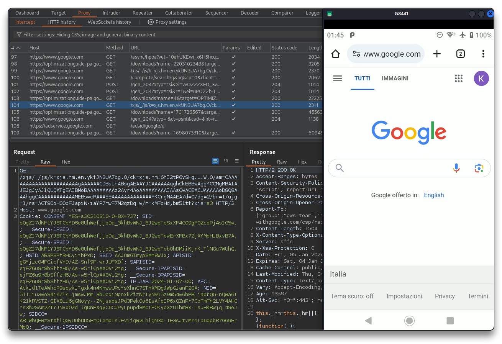
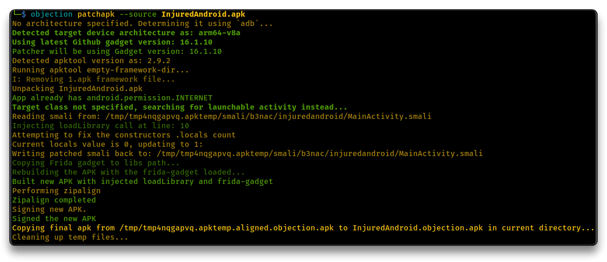
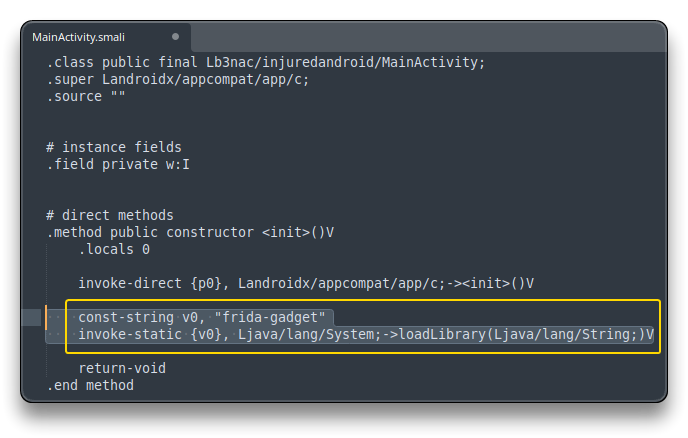

# 5. Android Dynamic Analysis

## SSL Pinning

**SSL pinning** enhances SSL/TLS security in mobile apps by associating a specific SSL certificate or public key with a server. This mitigates *Man-in-the-middle* risks by ensuring communication only with servers presenting the expected and pinned certificates.

- Even with the import of an Android user or root certificate, the app refuses to recognize it when SSL Pinning is active, preventing any attempts to intercept network traffic.

A pentester need to [bypass Certificate Pinning](https://mas.owasp.org/MASTG/techniques/android/MASTG-TECH-0012/) to see live application traffic.


## Proxyes

- [BurpSuite](https://portswigger.net/burp/communitydownload)
- [Proxyman](https://github.com/ProxymanApp/Proxyman) (available only on macOS)
- [mitmproxy](https://mitmproxy.org/)
- [Charles Proxy ](https://www.charlesproxy.com/)

**Android Interception Process**

1. Start the Proxy software and configure it
2. Set proxy on the emulator/physical device network settings
3. Intercept HTTP traffic
4. Import CA Certificates and trust them in the Certificate Store
5. Intercept HTTPS Traffic (failing with active SSL Pinning)
6. Use Objection/Frida tools to bypass SSL Pinning and intercept HTTPS Traffic

---

## MobSF Dynamic Analysis

> 🔗 [MobSF Dynamic Analyzer](https://mobsf.github.io/docs/#/dynamic_analyzer)
>
> - Supports x86, x86_64 architecture Android **4.1 - 11.0**, up to **API 30**
>
> 🔗 [Setting up MobSF dynamic analyzer for security testing of Android applications - Sarvesh Sharma](https://medium.com/@hacker7744/mobile-app-security-testing-setting-up-mobsf-dynamic-analyzer-for-security-testing-of-android-ios-173db5cae81e)

- Start the `Genymotion` Android VM (`e.g.` API 29 - it uses **Frida** and works out of the box) before starting `MobSF`
  - **Device identifier** - `192.168.56.103:5555`
- (If MobSF Dynamic Analyzer doesn’t detect the android device) Configure `ANALYZER_IDENTIFIER` as the VM's device identifier `192.168.56.103:5555` in the `~/docker/mobsf/config.py`

```bash
ANALYZER_IDENTIFIER = '192.168.56.103:5555'
```



- Run `MobSF` via Docker

```bash
docker run -it --rm --name mobsf -p 8000:8000 -v ~/docker/mobsf:/home/mobsf/.MobSF opensecurity/mobile-security-framework-mobsf:latest
```

- Navigate to [http://0.0.0.0:8000/dynamic_analysis/](http://0.0.0.0:8000/dynamic_analysis/) and click on `MobSFy Android Runtime` then `MobSFy!` button




- `Start Dynamic Analysis` on the desired application


- Try the various Dynamic **Testers** (Exported Activity, Activity, TLS/SSL) and check the outputs in the UI.


- Check the **Logcat Stream** and **Live API Monitor**
- **Start Instrumentation** with the selected Frida Scripts and check the Frida Logs
- **Generate Report** with the Dynamic Analysis information




---

## BurpSuite

> 🔗 [Configuring an Android device to work with Burp Suite](https://portswigger.net/burp/documentation/desktop/mobile/config-android-device)

Install `BurpSuite` and use it to intercept application traffic.

```bash
# Kali Linux Install
sudo apt update && sudo apt install -y burpsuite
```

- Set a new `Proxy Listener` bind to port `8082` on `All interfaces`


- Configure the device / emulator to use the proxy
  - **Settings > Network & internet > Wi-Fi Network details**
  - Modify the Advanced Options setting the Proxy to the host IP running BurpSuite  (`vboxnet` LAN or Bridged LAN IP) and port `8082`
- Open Chrome and navigate to **google.com**
- HTTPS Traffic cannot be intercepted because of the *unknow certificate* (PortSwigger CA)


- [Install the BurpSuite certificate](https://blog.ropnop.com/configuring-burp-suite-with-android-nougat) on the Android device

  - Export BurpSuite certificate in DER format but renaming during saving into `Burp_TCM.CER`

  

  - Copy the certificate to the device

  ```bash
  cd ~/tcm/mapt
  adb push Burp_TCM.CER /sdcard/
  ```

  - Install the certificate (Sony: **Settings > Lock screen & security > Advanced > Encryption & credentials > Install from device memory/SD card**)

- In BurpSuite turn Proxy Intercept ON and on the device re-open Chrome and navigate to **google.com**
  - BurpSuite is accepting HTTPS traffic and Google website is working in Chrome





---

## Frida & Objection

> 🔗 [Frida](https://frida.re/) - *Dynamic instrumentation toolkit for developers, reverse-engineers, and security researchers*
>
> - [Frida Gadget](https://frida.re/docs/gadget/)
>
> 🔗 [Objection](https://github.com/sensepost/objection) - *a runtime mobile exploration toolkit, powered by Frida*
>
> 🔗 [Apktool](https://apktool.org/docs/install#linux)

- Install first `Frida`, then `Objection`. Check the [Android Lab](../3-android-lab/README.md#frida-&-objection) for instructions.

[Patch the Android app with Objection](https://github.com/sensepost/objection/wiki/Patching-Android-Applications) by automating the patching process (using aapt, adb, jarsigner, apktool).

- *This command will determine the target architecture of your device using `adb`, extract the source APK, insert the INTERNET permission if it does not already exist, patch and embed the `frida-gadget.so` and repackage and sign a new APK for you.*

```bash
unset _JAVA_OPTIONS # may be necessary

objection patchapk --source InjuredAndroid.apk

# if no device connected, specify the target architecture using the --architecture flag.

# Uninstall the original app and install the patched one
adb uninstall b3nac.injuredandroid
adb install InjuredAndroid.objection.apk
```

> In case of "Can't Decode Resources" error with Kotlin apps, use the command
>
> ```bash
> objection patchapk --source InjuredAndroid.apk --use-aapt2
> ```



### Frida Manual Patching

>  🔗[Using Frida on Android without root (Android App Patching)](https://koz.io/using-frida-on-android-without-root/)

*Frida’s Gadget is a shared library meant to be loaded by programs to be instrumented when the Injected mode of operation isn’t suitable. Gadget gets kickstarted as soon as the dynamic linker executes its constructor function.*

> - With split apks, use [patch-apk tool](https://github.com/NickstaDB/patch-apk) - *An APK patcher, for use with objection, that supports Android app bundles/split APKs*

1. Decompile the `apk`

```bash
cd ~/apks
apktool d -r InjuredAndroid.apk
# -r does not decompile resources
```


2. Download frida native libraries (`frida-gadget`) for the CPU architecture of the physical/emulator device - [Frida release page](https://github.com/frida/frida/releases/)

```bash
# Get CPU architecture
adb shell getprop ro.product.cpu.abi
	arm64-v8a
adb shell cat /proc/cpuinfo
```

3. Add the `frida-gadget` into the APK’s /lib folder for the correct architecture - e.g. `InjuredAndroid/lib/arm64-v8a`

```bash
cd ~/apks/InjuredAndroid/lib/arm64-v8a # depends on the CPU architecture

wget -qO - https://github.com/frida/frida/releases/download/16.1.10/frida-gadget-16.1.10-android-arm64.so.xz | xz -d -c > libfrida-gadget.so
```

4. Inject `frida-gadget` into the bytecode (SMALI code) of the app, in a known exported activity or otherwise accessible Activity (usually `MainActivity.smali`, or `OnboardingActivity.smali`)

```bash
nano ~/apks/InjuredAndroid/smali/b3nac/injuredandroid/MainActivity.smali

# add the following lines in the ".method public constructor"
```

```bash
const-string v0, "frida-gadget"
invoke-static {v0}, Ljava/lang/System;->loadLibrary(Ljava/lang/String;)V
```



5. Add the Internet permission to the manifest if not already there (necessary for Frida to open a socket).
6. Repackage the application

```bash
apktool b -o InjuredAndroid_repackaged.apk InjuredAndroid/
```


7. Sign the `InjuredAndroid_repackaged.apk` and `zipalign` the app

```bash
# Create a Keystore
keytool -genkey -v -keystore demo.keystore -alias demokeys -keyalg RSA -keysize 2048 -validity 10000

# Sign the APK
jarsigner -sigalg SHA1withRSA -digestalg SHA1 -keystore demo.keystore -storepass demopw InjuredAndroid_repackaged.apk demokeys

# Check the signing status
jarsigner -verify --verbose InjuredAndroid_repackaged.apk

# zipalign the APK
zipalign -v 4 InjuredAndroid_repackaged.apk InjuredAndroid_repackaged-final.apk
```

8. Install the signed and aligned app

```bash
adb uninstall b3nac.injuredandroid
adb install InjuredAndroid_repackaged-final.apk
```

9. Open the app and test Objection

```bash
frida-ps -Uai
objection -g b3nac.injuredandroid explore
```

### Objection Usage

```bash
objection -g b3nac.injuredandroid explore

# Some objection commands
android sslpinning disable
android clipboard monitor
memory dump all /tmp/dumped
android keystore list
android keystore watch
android root disable
android root simulate
```

### Frida Codeshare

> 🔗 [Frida CodeShare](https://codeshare.frida.re/)

Find various Frida scripts in the Frida CodeShare projects.

- `e.g.` 
  - [Universal Android SSL Pinning Bypass with Frida](https://codeshare.frida.re/@pcipolloni/universal-android-ssl-pinning-bypass-with-frida/)
  - [Frida Antiroot](https://codeshare.frida.re/@dzonerzy/fridantiroot/)
  - [iOS App Info](https://codeshare.frida.re/@dki/ios-app-info/)

```bash
# Run it with
frida -U --codeshare pcipolloni/universal-android-ssl-pinning-bypass-with-frida -f b3nac.injuredandroid

frida -U --codeshare dzonerzy/fridantiroot -f b3nac.injuredandroid

frida -U --codeshare dki/ios-app-info -f b3nac.injuredandroid

# Or copy the code into a .js file and use it with frida/objection
frida -U -f b3nac.injuredandroid -l fridantiroot.js
```

```bash
# Objection
objection -g b3nac.injuredandroid explore --startup-script fridantiroot.js

objection -g b3nac.injuredandroid explore -s "android root disable"
```

---

## Additional Dynamic Analysis

### **App file system**

Always check the `/data/data/` directory of the analyzed app.


### **Logcat - Pidcat**

Look through the `logcat` logs.

- Check system and application logs with `logcat` or [`pidcat`](https://github.com/JakeWharton/pidcat) for unintended data leakage

```bash
# Logcat
adb logcat | grep "$(adb shell ps | grep <package-name> | awk '{print $2}')"

adb logcat -d -b all -v long -e b3nac.injuredandroid

# Pidcat
sudo apt install pidcat

pidcat b3nac.injuredandroid
```

---

